# Desplegar un recurso real y medir su coste en Azure

**Autor:** Christian Salguero Varas <br>
**Fecha:** 22/09/2026 - 23/09/2026 - 24/09/2026

---

## 1. Estimar el coste antes de desplegar

Para esta estimación necesitas estos tres componentes:
- Virtual Machines
- Managed Disks
- IP Addresses

A tener en cuenta: la calculadora está en euros (€) y Azure al tenerlo en Inglés está en dolares ($).

Configuramos la máquina con los valores indicados.

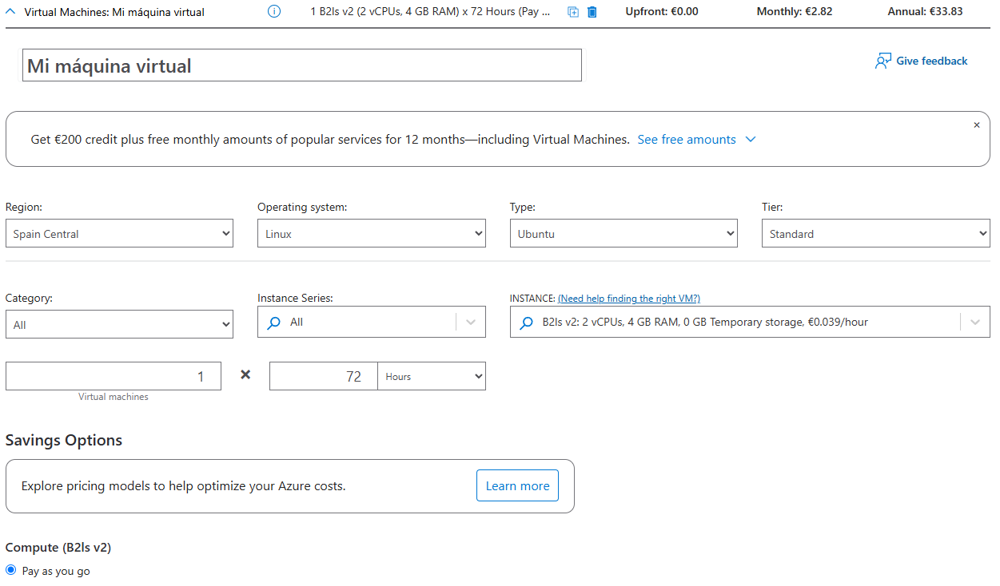 <br>
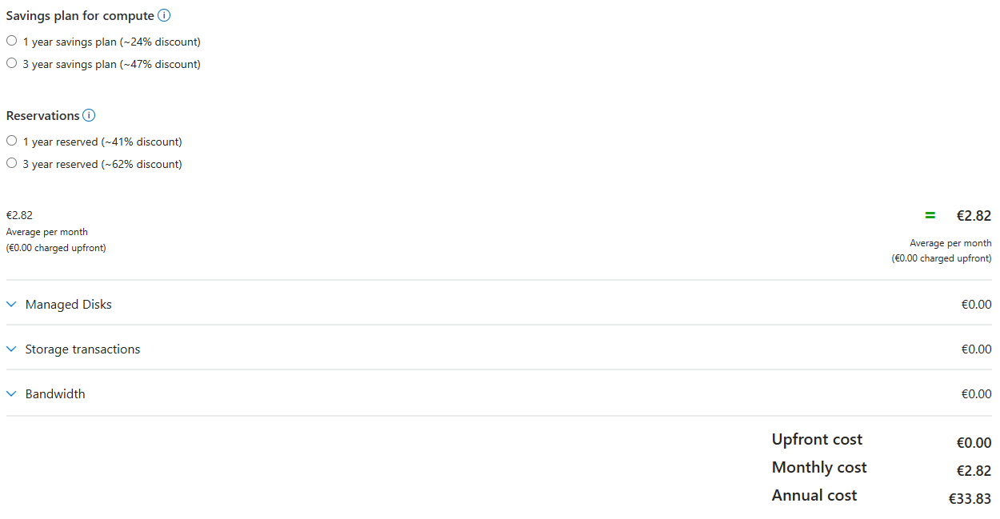

Configuramos el disco con los valores indicados.

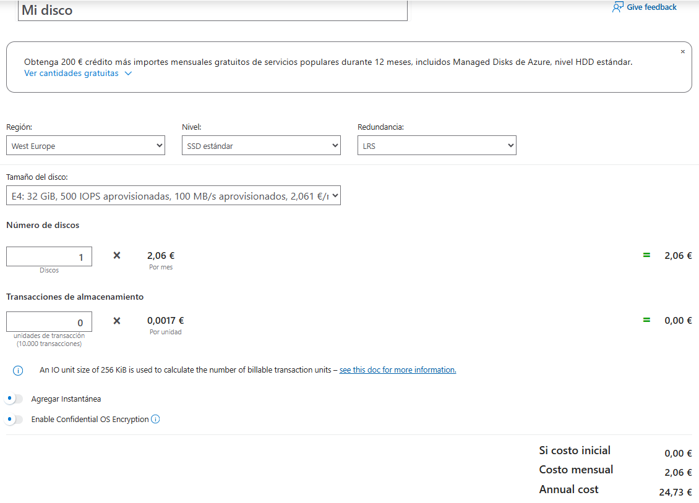

Configuramos la IP pública.

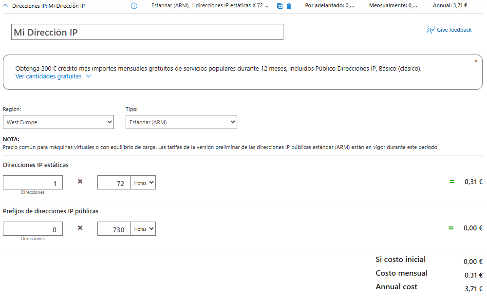

Cálculo de los tres escenarios:

| Escenario | Horas de cómputo | Coste cómputo (mensual) | Coste disco | Coste IP | Total estimado |
| :--- | :---: | :---: | :---: | :---: | :---: |
| **A. VM encendida todo el laboratorio** | 72 | 2,82€ | 0,20€ | 0,31€ | **3,33€** |
| **B. VM con apagado automático nocturno (≈ 12 h/día)** | 36 | 1,41€ | 0,20€ | 0,31€ | **1,92€** |
| **C. VM encendida solo 8 h en total** | 8 | 0,31€ | 0,20€ | 0,31€ | **0,82€** |


## Creación del Resource Group

En Azure accedemos a `Resource groups` y creamos el grupo de recursos con la siguiente información:

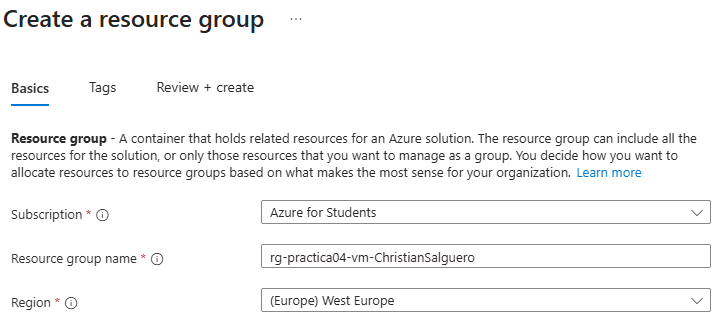

Agregamos sus Tags:

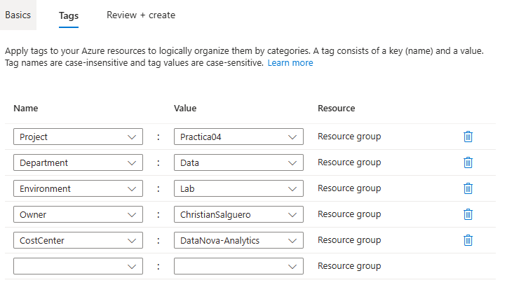

Cambiamos el scope para crear el Budget correctamente.

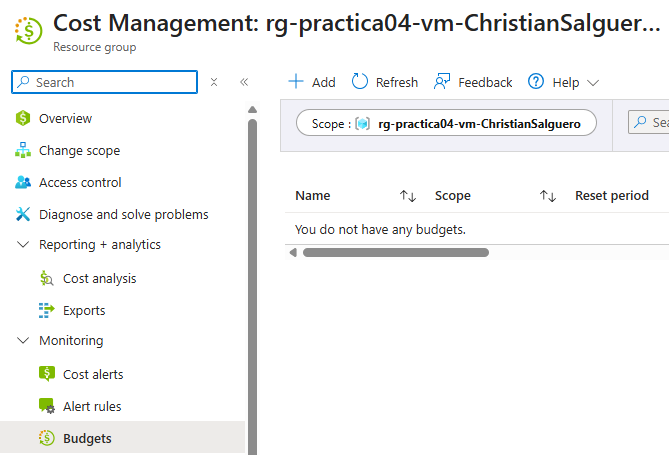

Creamos el Budget con la información necesaria.

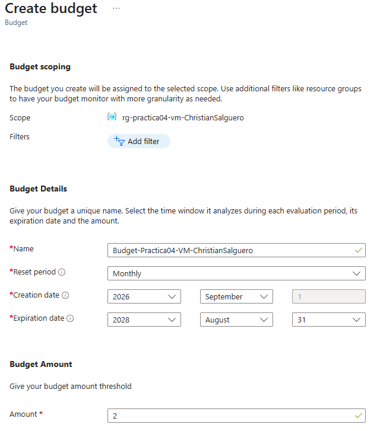

Configuramos las alertas.

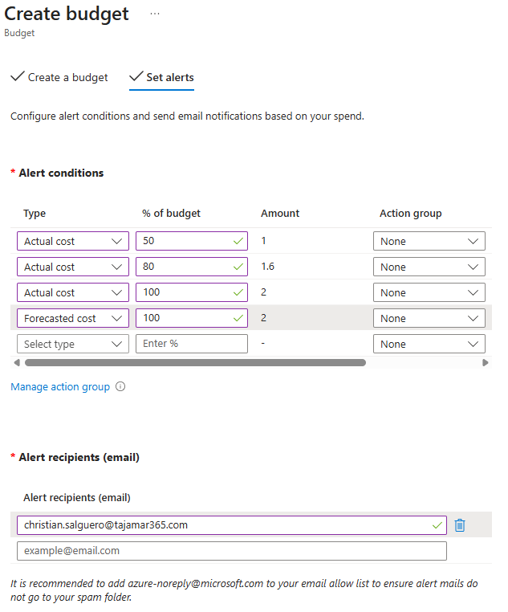

## Deplegar la Máquina Virtual

Definimos los primeros valores de la máquina virtual. Como entre nuestras regiones permitidas no está `West Europe` he buscado cuál tenía disponible la instancia deseada y esa era `Spain Central`.

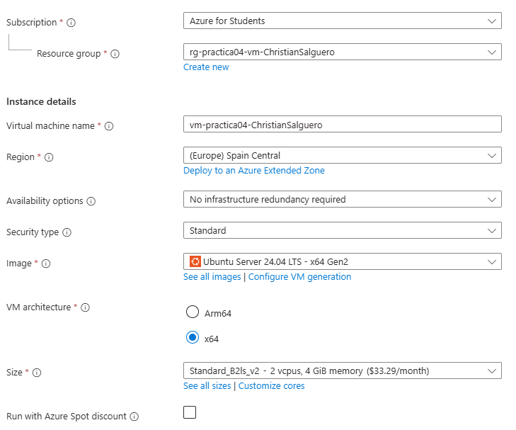

Comparamos la instancia entre la calculadora y Azure y vemos que son la misma con mismo valor (ambas están en dolares $).

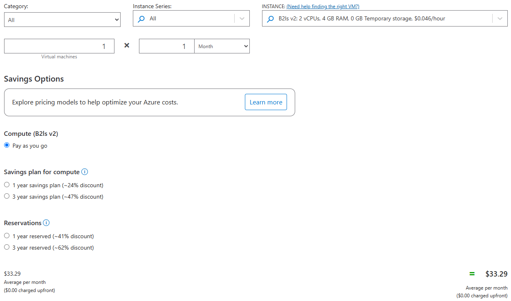

Definimos los valores del disco.

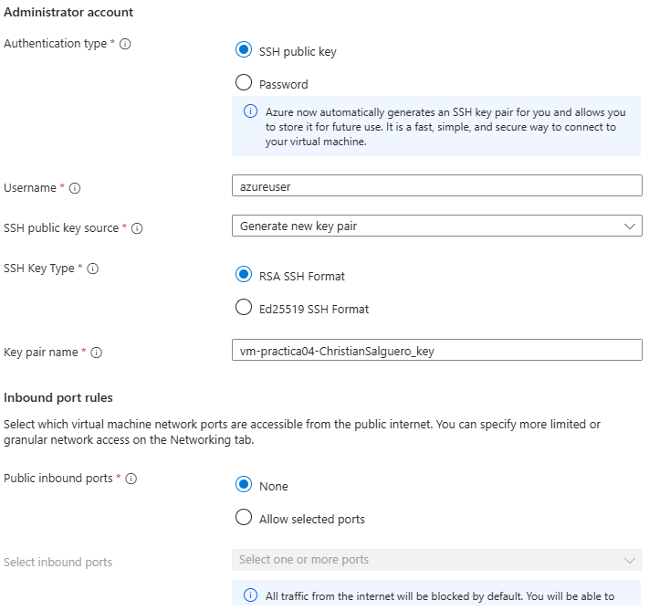

Definimos los valores de red.

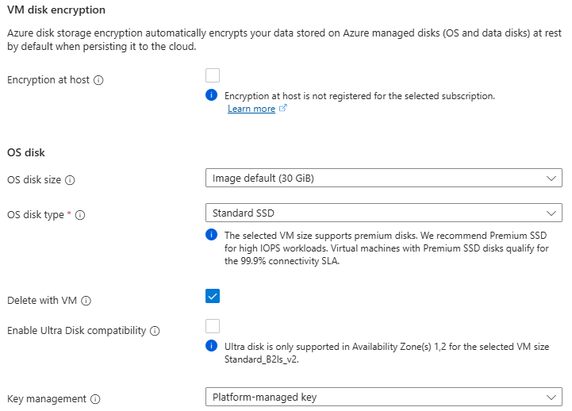 <br>
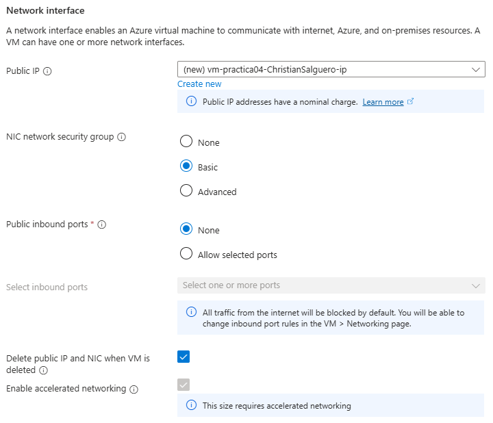

No podemos marcas la opción de `Auto ShutDown` ya que no está disponible en `Spain Central`. Más adelante intento volver a activar esta opción y me da error.

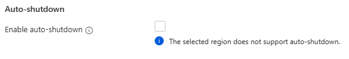

Agregamos los Tags a la máquina virtual:

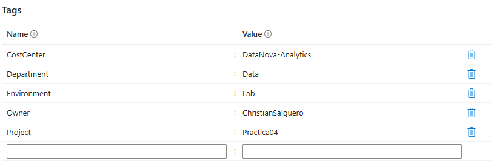

Revisamos que todo está correcto y creamos la máquina virtual. Aquí podemos ver como el consumo por hora es el mismo que en la calculadora.

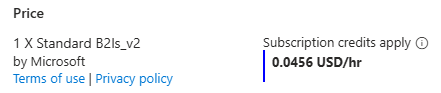

Nos descargamos la clave privada SSH.

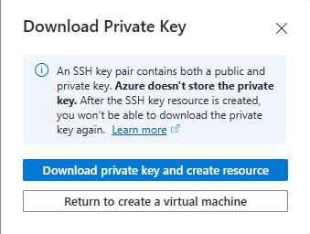

Y la máquina virtual se empezará a crear y desplegar.

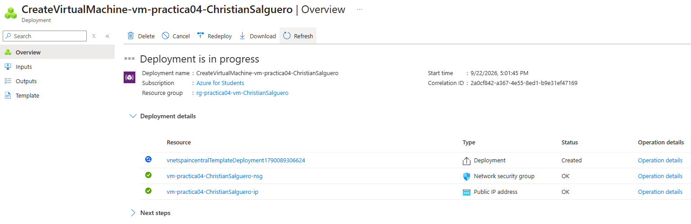

Máquina virtual creada correctamente.

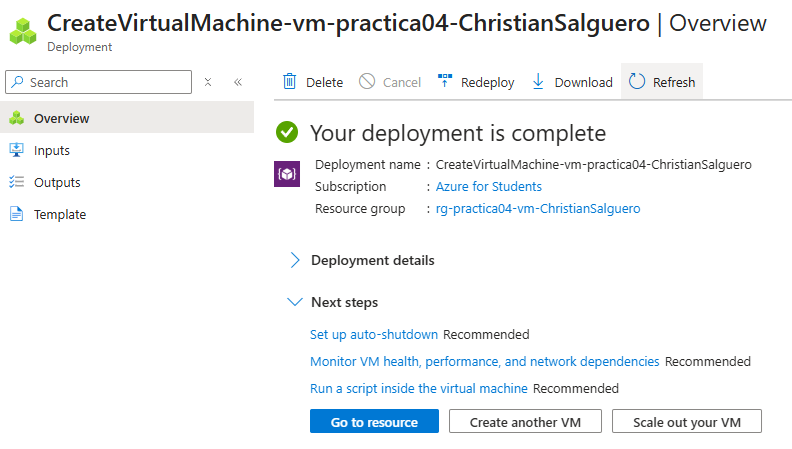

| Dato | Valor |
| :--- | :--- |
| **Precio por hora mostrado por el portal** | 0.0456 USD/hr |
| **Precio por hora según tu estimación** | 0.046 USD/hr |
| **Fecha y hora de creación** | 17:01:47 22/09/2026 |

Con la máquina ya creada vuelvo a intentar agregar la orden `Auto ShutDown`.

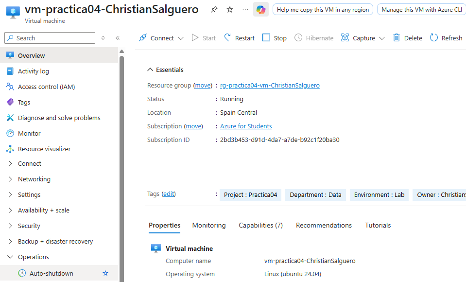 <br>
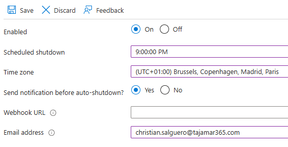

Cuando pulsamos en `Save` nos salta este error:

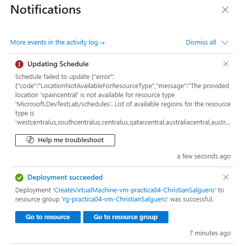

Que nos indica que la opción no está disponible en la región seleccionada.

## Verificar el etiquetado de todos los recursos

| Recurso | Tipo | ¿Tiene los 5 Tags? | ¿Genera coste? |
| :--- | :--- | :---: | :---: |
| **vm-practica04-ChristianSalguero** | Virtual machine | Sí | Sí |
| **vm-practica04-ChristianSalguero_OsDisk_1_8fbbd4cdfa48411181b5c94f8945a3fa** | Disk | Sí | Sí |
| **vm-practica04-ChristianSalguero-ip** | Public IP address | Sí | Sí |
| **vm-practica04-christiansalguero103** | Network interface | Sí | No |
| **vm-practica04-ChristianSalguero-nsg** | Network security group | Sí | No |
| **vnet-spaincentral-1** | Virtual network | No | No |

Comprobando cada apartado el único que no tenía las Tags era la `Virtual Network` entonces se los agregué a mano.

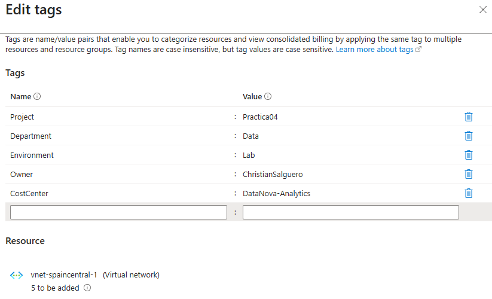

## Primera revisión en Cost Analysis

| Recurso | Coste acumulado |
| :--- | :---: |
| **Máquina virtual** | 0.16€ |
| **Disco** | 0.03€ |
| **IP pública** | 0.05€ |
| **Otros** | 0.01€ |
| **Total (Actual Cost)** | **0.25€** |

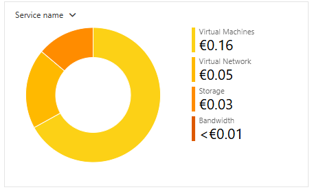

## Segunda revisión en Cost Analysis

| Recurso | Coste acumulado |
| :--- | :---: |
| **Máquina virtual** | € |
| **Disco** | € |
| **IP pública** | € |
| **Otros** | € |
| **Total (Actual Cost)** | **€** |

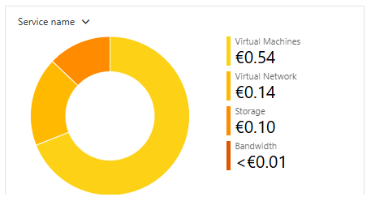

### Ver el coste por medidor

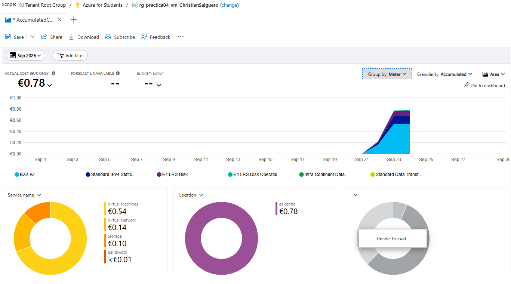

### Ver el coste diario

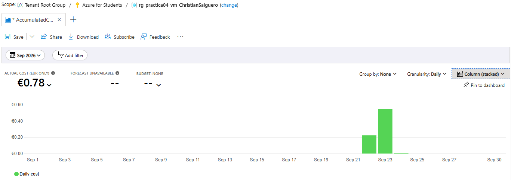

### Ver el coste por Tag

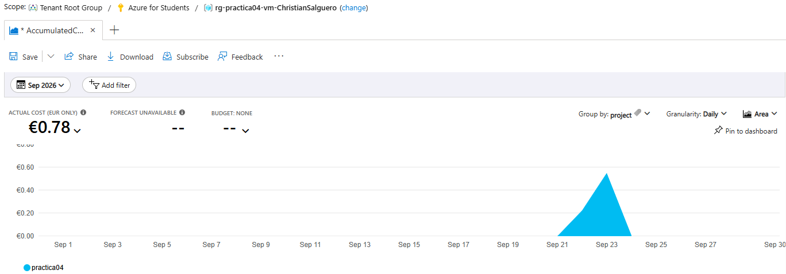

### Consultar la previsión

No se puede visualizar la previsión de forecast porque indica que 3 días es insuficiente para calcularlo.

| Dato | Valor |
| :--- | :---: |
| **Actual Cost** | 0.78€ |
| **Forecasted Cost (fin de mes)** | No disponible |
| **Budget del laboratorio** | 2€ |
| **¿Actual supera el Budget?** | No |
| **¿Forecast supera el Budget?** | Sí/No |

### Revisar las alertas

No se ha activado ninguna ya que lo máximo que se ha llegado a gastar ha sido 0.78€ que queda lejos de 1€.

| Alerta | ¿Se ha activado? | Fecha y hora |
| :--- | :---: | :---: |
| **Actual 50%** | No | n/a |
| **Actual 80%** | No | n/a |
| **Actual 100%** | No | n/a |
| **Forecasted 100%** | No | n/a |

## Experimento: apagar no es lo mismo que desasignar

## Comparar estimación y coste real

Se está comparando con la estimación B. También hay que tener en cuenta que la máquina ha sido apagada por las noches y encendida por el día.

| Concepto | Estimado (Sección 3) | Real (Cost Analysis) | Diferencia |
| :--- | :---: | :---: | :---: |
| **Cómputo** | 1,41€ | 0,54€ | 0,87€ |
| **Disco** | 0,20€ | 0,10€ | 0,10€ |
| **IP pública** | 0,31€ | 0,14€ | 0,17€ |
| **Total** | **1,92€** | **0,78€** | **1,14€** |

## Verificación día final (día 4)

Podemos ver que el cuarto día (25/09/2026) hay un gasto de 0.0€. También se puede observar que el gasto del día anterior es mayor que las capturas anteriores, y esto es debido a otras prácticas realizadas sobre SQL, etc.
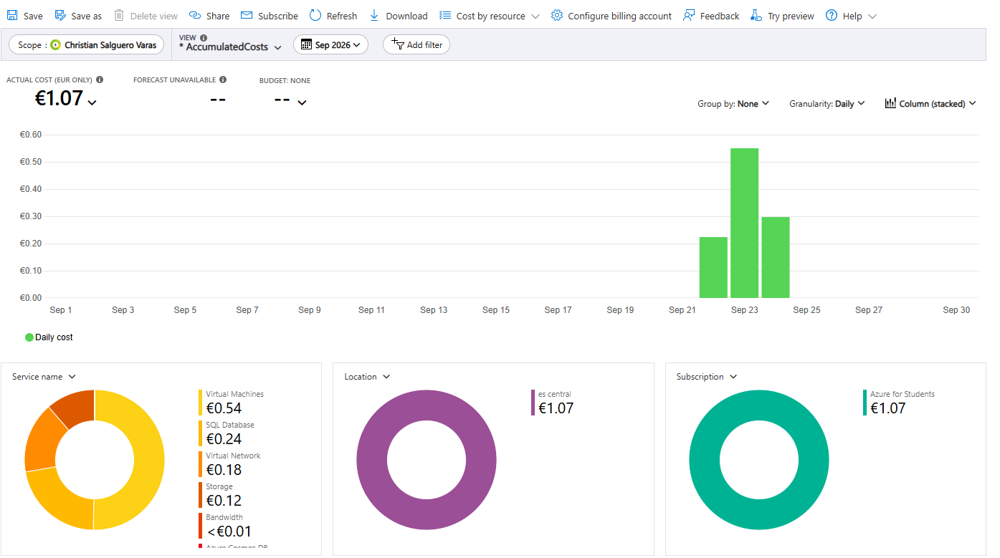

## Limpieza

Eliminamos el Resource Group.
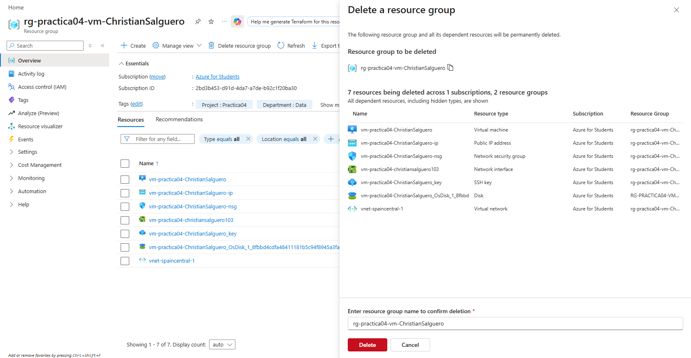

Tras esperar unos minutos el grupo de recurso se elimina completamente al igual que todos sus recursos. Como ya no hay recursos con Tags, no puedo filtrar por Tags.
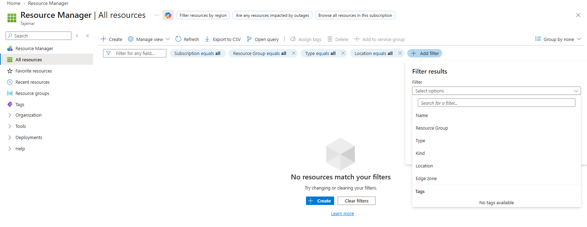

## Informe final

| Elemento | Resultado |
| --- | --- |
| Nombre de la práctica | Práctica 04 — VM Linux con control de costes |
| Resource Group | rg-practica04-vm-alumnoXX |
| Servicios utilizados | Virtual Machine, Managed Disk, Pubilc IP, Virtual Network |
| Coste estimado antes de desplegar | 1,92€ |
| Budget disponible | 2,00€ |
| Alertas configuradas | Actual 50% (1,00 €), Actual 80% (1,60 €), Actual 100% (2,00 €) y Forecasted 100% (2,00 €) |
| Alertas activadas | Ninguna (el gasto máximo fue de 0,78€) |
| Coste observado | 0,78€ |
| Recurso con mayor coste | Máquina virtual / Cómputo (0,54 €) |
| Recursos eliminados | Todos los recursos del Resource Group (rg-practica04-vm-alumnoXX) eliminados completamente al finalizar el Día 3 |
| Observaciones | El coste real (0,78 €) fue inferior al estimado (1,92 €) debido a que la Virtual Machine permaneció encendida menos de las 36h previstas. El auto-shutdown no estaba disponible en la región Spain Central, por lo que el apagado lo hice manualmente. Las alertas no se llegaron a disparar y el pronóstico (Forecast) no estuvo disponible por falta de histórico. |

## Ejercicio final
Un equipo de DataNova Engineering despliega cinco VMs de pruebas con esta configuración:

```
Budget del proyecto          = 50 €
Actual Cost (día 10 del mes) = 22 €
Forecasted Cost              = 68 €
Apagado automático           = No configurado
Estado de 3 VMs              = Stopped (no deallocated)
```

Responde:

### 1. ¿Qué alertas se habrán activado con umbrales Actual 50 %, 80 %, 100 % y Forecasted 100 %?
Se ha activado el Forecasted al 100% ya que ahora mismo el Forecasted Cost es mayor que 50€. El resto de alertas no se han activado.

### 2. ¿Por qué el Forecasted Cost es tan superior al Actual Cost?
Porque el Actual Cost es de 22€ y representa únicamente los gastos acumulados en los primeros 10 días del mes. Azure toma ese ritmo de consumo actual y lo proyecta para todo el mes (el resto de 20 días).

### 3. ¿Qué parte del gasto de las 3 VMs detenidas se podría eliminar sin borrarlas?
Al cambiar el estado de las VMs de Stopped (apagadas desde su sistema operativo) a Stopped (Deallocated) (desasignadas desde el portal de Azure), Azure libera los recursos hardware y deja de cobrar el cómputo por horas. El disco y la IP pública asignada seguirán cobrándose mientras existan.

### 4. Ordena estas acciones de mayor a menor impacto en el ahorro inmediato:
[ 1 ] Desasignar las 3 VMs detenidas. (Elimina inmediatamente el cobro por hora del cómputo de 3 máquinas que no se están usando).

[ 2 ] Configurar apagado automático en las 5 VMs. (Reduce masivamente las horas de cómputo activas).

[ 3 ] Cambiar los discos de Premium SSD a Standard SSD. (Ahorro permanente en el almacenamiento).

[ 4 ] Eliminar las IP públicas que no se usan. (Ahorro continuo menor por IP pública reservada).

[ 5 ] Añadir Tags a todos los recursos. (Impacto nulo en el coste directo).

### 5. ¿Cuál de las acciones anteriores no ahorra dinero pero es imprescindible para analizarlo?
Añadir Tags a todos los recursos.

Aplicar etiquetas no reduce la factura de Azure, pero es un paso indispensable para tener controlado el gasto por proeycto, departamento, etc. Y detectar qué recursos o equipos están generando más gastos.

## Referencias oficiales

- Microsoft Learn — Tutorial: Create and manage budgets
    https://learn.microsoft.com/azure/cost-management-billing/costs/tutorial-acm-create-budgets
    
- Microsoft Learn — Cost Analysis
    https://learn.microsoft.com/azure/cost-management-billing/costs/quick-acm-cost-analysis
    
- Microsoft Learn — Group and filter options in Cost Analysis and Budgets
    https://learn.microsoft.com/azure/cost-management-billing/costs/group-filter
    
- Microsoft Learn — Create a Linux virtual machine in the Azure portal
    https://learn.microsoft.com/azure/virtual-machines/linux/quick-create-portal
    
- Microsoft Learn — States and billing status of Azure Virtual Machines
    https://learn.microsoft.com/azure/virtual-machines/states-billing
    
- Microsoft Learn — Auto-shutdown a virtual machine
    https://learn.microsoft.com/azure/virtual-machines/auto-shutdown-vm
    
- Azure Pricing Calculator
    https://azure.microsoft.com/pricing/calculator/
